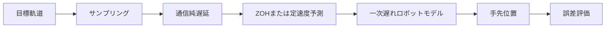

# アーキテクチャ

## 予定する信号経路

## 予定モデル

補償方式の予定モデルは次のとおりです。

- ZOH: `u_ZOH(t) = r(t_k)`
- 定速度予測: `u_CV(t) = r(t_k) + (t - t_k) r_dot(t_k)`
- 一次遅れ: `T x_dot(t) + x(t) = u(t)`

これらの科学モデル、数値積分、誤差評価はこのスケルトンでは未実装です。式は今後の実装境界を固定するための予定仕様であり、実験結果を示すものではありません。
